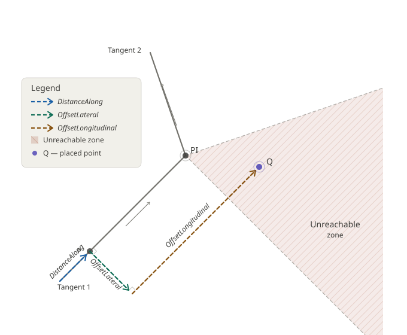

# IfcPointByDistanceExpression

An _IfcPointByDistanceExpression_ describes a point relative to a basis curve according to distance along the projection of the basis curve in the horizontal plane. The offsets are relative to the basis curve where the values correspond to the following:

* lateral to the basis curve
* offset vertical to the basis curve
* optional additional offset parallel to the basis curve that may be used to address locations otherwise unreachable where the basis curve is tangentially discontinuous.
<!-- end of short definition -->

## Attributes

### DistanceAlong
The distance along the horizontal projection of the basis curve measured as either a _IfcLengthMeasure_ or _IfcParameterValue_.

### OffsetLateral
Offset measured horizontally perpendicular to the basis curve, where positive values indicate to the left of the basis curve as facing in the positive parametrization direction of the basis curve, and negative values indicate to the right. If DistanceAlong coincides with a point of tangential discontinuity (within precision limits), then the tangent of the previous segment governs.

### OffsetVertical
Offset vertical to the basis curve where positive values indicate perpendicular to the tangent of the basis curve at DistanceAlong.

### OffsetLongitudinal
Offset parallel to the basis curve after applying DistanceAlong, OffsetLateral, and OffsetVertical to reach locations for the case of a tangentially discontinuous basis curve.

### BasisCurve
